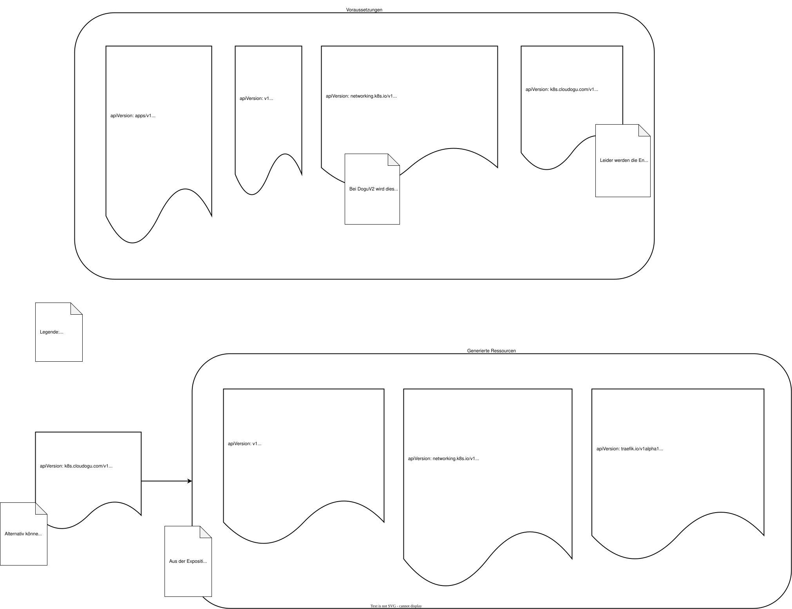

# Exposition Custom Resource

Eine [Exposition-CRD](https://github.com/cloudogu/k8s-exposition-lib/blob/develop/docs/operations/exposition_cr_de.md) ist eine Kubernetes-Custom-Resource, die definiert, wie ein Service von außerhalb des Clusters erreichbar gemacht wird.
Sie unterstützt HTTP-Routen (Layer 7) sowie rohe TCP- und UDP-Ports (Layer 4).
Für jede Exposition erstellt der Operator die notwendigen Ingress-Objekte und weist für TCP/UDP-Einträge einen Port am LoadBalancer-Service des Clusters zu.

Folgendes Schaubild zeigt die Port-Mappings und das Erzeugen von TCP-Routen aus der Exposition-CR:

## Lifecycle-Verhalten

Der Operator passt das HTTP-Routing automatisch an den Zustand des zugehörigen Dogus und den globalen Wartungsmodus an:

- **Dogu startet** — HTTP-Routen liefern vorübergehend eine Startseite, bis der Dogu bereit ist
- **Dogu gestoppt** — HTTP-Routen sind deaktiviert; kein Traffic wird an die Anwendung weitergeleitet
- **Wartungsmodus aktiv** — alle HTTP-Routen aller Expositionen liefern die globale Wartungsseite; dieser Zustand überschreibt den Dogu-Zustand
- **TCP- und UDP-Routen** sind vom Dogu-Lifecycle und vom Wartungsmodus nicht betroffen

Alle vom Operator erstellten Ressourcen (Ingress-Objekte, Middleware, IngressRouteTCP, IngressRouteUDP) gehören der Exposition-CR.
Das Löschen einer Exposition entfernt automatisch alle von ihr erstellten Ressourcen.

