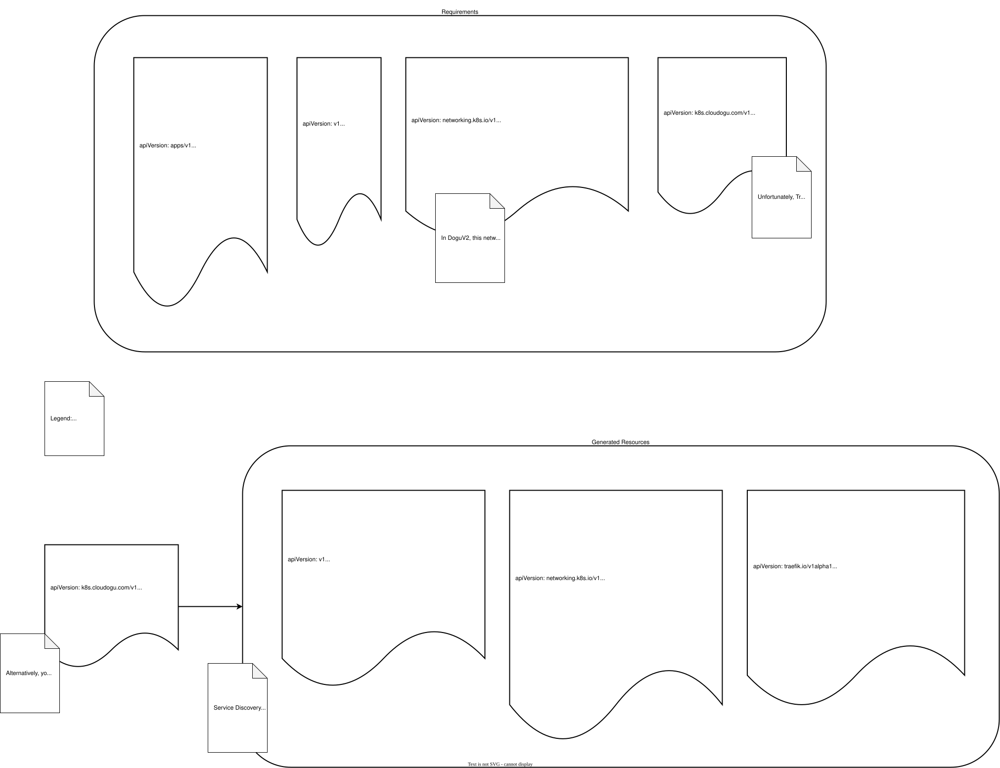

# Exposition Custom Resource

An [Exposition-CRD](https://github.com/cloudogu/k8s-exposition-lib/blob/main/docs/operations/exposition_cr_en.md) is a Kubernetes custom resource that defines how a service is made reachable from outside the cluster.
It supports HTTP (Layer 7) routes as well as raw TCP and UDP (Layer 4) ports.
For each Exposition the operator creates the necessary ingress objects and, for TCP/UDP entries, allocates a port on the cluster's LoadBalancer Service.

The following figure shows the port mappings and creation of TCP routes from an Exposition-CR:

## Lifecycle Behaviour

The operator adjusts HTTP routing automatically based on the state of the associated Dogu and the global maintenance mode:

- **Dogu is starting** — HTTP routes temporarily serve a splash page until the Dogu becomes healthy
- **Dogu is stopped** — HTTP routes are suspended; no traffic is forwarded to the application
- **Maintenance mode active** — all HTTP routes across all Expositions serve the global maintenance page; this overrides the Dogu state
- **TCP and UDP routes** are not affected by Dogu lifecycle or maintenance mode

All resources created by the operator (Ingress objects, Middleware, IngressRouteTCP, IngressRouteUDP) are owned by the Exposition CR.
Deleting an Exposition automatically removes all resources it created.

